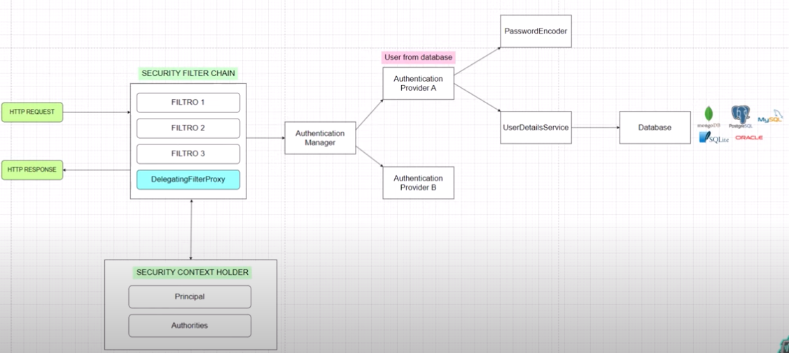

# Spring Security 6 - Demo 01

Este proyecto se enfoca en demostrar la autenticación básica utilizando una base de datos con Spring Security. A través de una arquitectura de seguridad bien definida, el proyecto guía en la implementación de aspectos cruciales de seguridad web, tales como filtros de seguridad, manejo de autenticaciones y autorizaciones, y configuración de contextos de seguridad, todo ello orientado a fortalecer la comprensión y aplicación práctica de Spring Security en aplicaciones modernas.

## Spring Security Architecture

- Security Filter Chain: Serie de filtros que cada solicitud HTTP debe atravesar, aplicando diferentes capas de seguridad.

- Delegation Filter Proxy: Actúa como un puente, delegando responsabilidades de seguridad a otros componentes personalizados dentro del marco de Spring Security.

- Authentication Manager: Corazón de la autenticación, decide qué Authentication Provider usar para validar credenciales.

- Authentication Provider: Implementa la lógica específica para verificar las credenciales del usuario.

- Password Encoder: Herramienta para codificar contraseñas de manera segura, evitando almacenarlas en texto plano.

- UserDetails Service: Interfaz que carga datos específicos del usuario para la autenticación.

- Security Context Holder: Almacena los detalles de la sesión actual, incluyendo el usuario y sus permisos.

- Principal: Representa la identidad actualmente autenticada.

- Authorities: Define los roles o permisos que tiene el usuario autenticado.

## Flujo de una petición

1. Petición llega: La petición HTTP ingresa al sistema. 
2. Delegation Filter Proxy: Interceptar la petición y delegarla a la Security Filter Chain.
3. Security Filter Chain: Compuesta por múltiples filtros que ejecutan tareas específicas de seguridad.
4. Authentication Filter: Identifica si se necesitan credenciales y las extrae.
5. Authentication Manager: Delega la autenticación a un Authentication Provider adecuado.
6. Load UserDetails: UserDetails Service carga información del usuario.
7. Password Comparison: Password Encoder verifica la contraseña.
8. Security Context Holder: Almacena los detalles del usuario autenticado.
9. Authorization: Se verifica si el usuario tiene permiso para acceder al recurso.
10. Acceso concedido o denegado: Según la autorización, se permite o niega el acceso al recurso solicitado.
